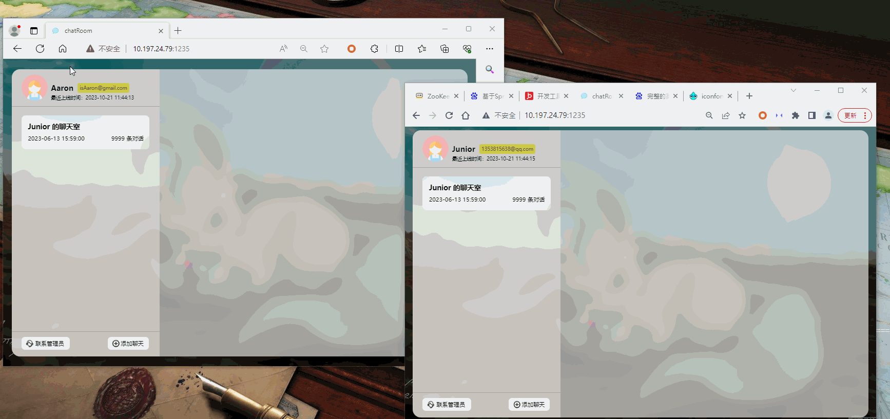

# 网页聊天室

#### 网页截图
- 登录部分预览动图

- 发送文字预览动图

- 发送文件预览动图


#### 介绍
使用springboot+websocket开发，实现多人聊天室。聊天室实现文字和文件发送，同时支持发送失败重试。还能添加不同的聊天室，并在多个聊天室切换聊天

#### 使用前准备
执行resources目录下sql包里面的mysql.sql

### 配置 HTTPS
- 获取证书
 1. 使用外网环境证书自行百度获取
 2. 内网环境，可以使用自签名证书，[生成自签名证书](https://blog.csdn.net/sinat_38854292/article/details/123160357)
- 将 yml 文件中 websocket 的 protocol 改为 wss://, 同时将 port 改为 443
- nginx 配置
```nginx configuration
http {

    include       mime.types;
    default_type  application/octet-stream;
    proxy_headers_hash_max_size 51200;
    proxy_headers_hash_bucket_size 6400;
    sendfile        on;
    keepalive_timeout  65;
    client_max_body_size 3072m;
    server_tokens off;
    tcp_nopush on;
    tcp_nodelay on;
    client_header_timeout 10;
    client_body_timeout 10;
    reset_timedout_connection on;
    send_timeout 10;
    limit_conn_zone $binary_remote_addr zone=addr:5m;
    limit_conn addr 100;
    charset UTF-8;
    gzip on;
    gzip_disable "msie6";
    gzip_proxied any;
    gzip_min_length 1000;
    gzip_comp_level 4;
    gzip_types text/plain text/css application/json application/x-javascript text/xml application/xml application/xml+rss text/javascript;
    open_file_cache max=100000 inactive=20s;
    open_file_cache_valid 30s;
    open_file_cache_min_uses 2;
    open_file_cache_errors on;


    #gzip  on;

    server {
        listen       80;
        listen       [::]:80;
        rewrite ^(.*)$ https://$host$1 permanent;
    }


    # HTTPS server
    #
    server {
        listen       443 ssl ;
        server_name  10.197.24.79;

        ssl                  on;
        ssl_certificate      D:\mkcert\10.197.24.79.pem;
        ssl_certificate_key  D:\mkcert\10.197.24.79-key.pem;

        ssl_session_timeout  5m;

        ssl_prefer_server_ciphers On;
        ssl_protocols TLSv1 TLSv1.1 TLSv1.2;
        ssl_ciphers ECDH+AESGCM:ECDH+AES256:ECDH+AES128:ECDH+3DES:RSA+AESGCM:RSA+AES:RSA+3DES:!aNULL:!eNULL:!MD5:!DSS:!EXP:!ADH:!LOW:!MEDIUM;

        location / {
            proxy_http_version 1.1;
            proxy_set_header Upgrade $http_upgrade;
            proxy_set_header Connection "upgrade";
            proxy_pass_header Set-Cookie;
            proxy_set_header X-Real-IP $remote_addr;
            proxy_set_header X-Forwarded-For $remote_addr;
            proxy_set_header X-Forwarded-For $proxy_add_x_forwarded_for;
            proxy_set_header Host $host;
            proxy_redirect off;

            add_header Access-Control-Allow-Origin *;
            add_header Access-Control-Allow-Methods "POST, GET,PUT,DELETE, OPTIONS";
            add_header Access-Control-Allow-Headers "Origin, Authorization, Accept";
            add_header Access-Control-Allow-Credentials true;

            proxy_read_timeout 60m;  # 增加Nginx接收到后端服务器响应的超时时间为5分钟
            proxy_send_timeout 60m;  # 增加Nginx向后端服务器发送请求的超时时间为5分钟
            #设置字符集
            charset utf-8;
            proxy_pass http://10.197.24.79:1234;
        }


    }

}
```

#### 环境

- java 1.8
- SpringBoot 2.3.6.RELEASE
- LomBok 1.18.16 (需要lombok插件)
- validator 6.1.6.Final
- mybatis 2.2.0
- pagehelper-spring-boot-starter 1.4.3
- mapstruct 1.4.2.Final
- mapstruct-processor 1.4.2.Final
- spring-cloud-starter-alibaba-sentinel 2021.1


