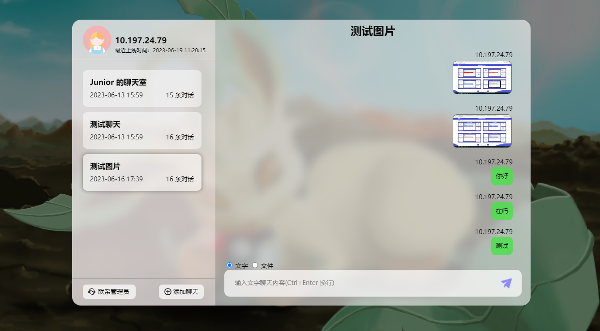

# 网页聊天室

#### 网页截图

#### 介绍
使用springboot+websocket开发，实现多人聊天室。聊天室实现文字和文件发送，同时支持发送失败重试。还能添加不同的聊天室，并在多个聊天室切换聊天

#### 使用前准备
执行resources目录下sql包里面的mysql.sql

#### 环境

- java 1.8
- SpringBoot 2.3.6.RELEASE
- LomBok 1.18.16 (需要lombok插件)
- validator 6.1.6.Final
- mybatis 2.2.0
- pagehelper-spring-boot-starter 1.4.3
- mapstruct 1.4.2.Final
- mapstruct-processor 1.4.2.Final
- spring-cloud-starter-alibaba-sentinel 2021.1

